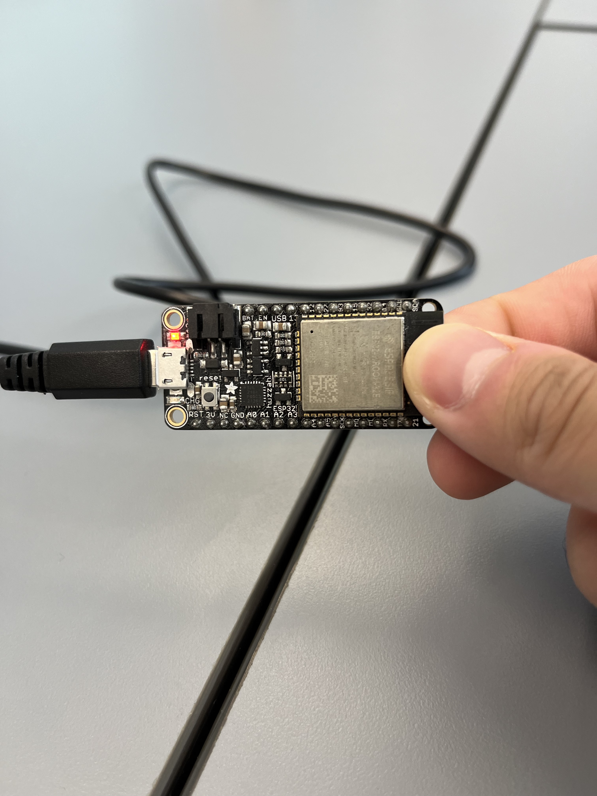

#  Skill Name

Author: Eric Chen

Date: 2023-09-07


### Summary
This is me blinking the onboard led on the ESP32 board. 

### Sketches/Diagrams


### Modules, Tools, Source Used Including Attribution


### Supporting Artifacts


### AI Use

I used {chat.openai.com GPT-3.5} on {8/30/2023} with the following prompt:

***Prompt***

```
{prompt}

```

***Code Attribution***

I have included a comment in my code for this assignment stating the following:

```
// This code block was generated by {name} using {chat.openai.com
GPT-3.5} on {8/30/2023}

```
